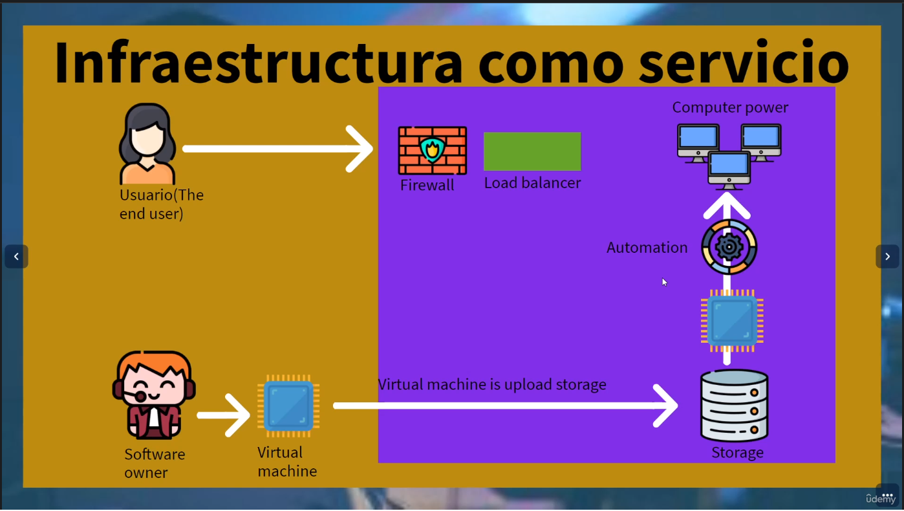

# Infraestructure as a service

Provee el fundamento y base de cloud computing, este servicio te proporciona lo que son la base (infraestructura física) en la nube o sea virtualizada y es manejable o administrado a través de Internet. 

* Servidores y computadoras virtuales
* datacenter virtuales
* seguridad virtual
* capacidad de almacenamiento
* redes virtuales 

