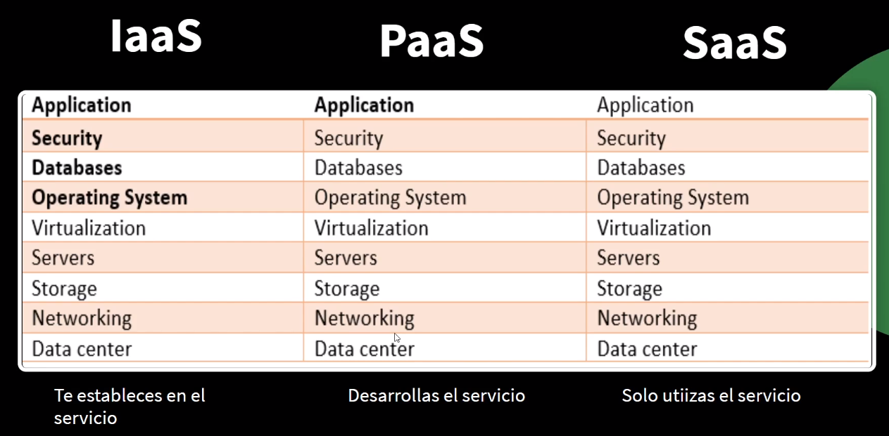

# Introducción a cloud

## Nube

(**Cloud** ) almacenamiento alojado en la red donde cualquier usuario puede guardar y acceder a la información que ha almacenado siempre y cuando tenga acceso a internet. Además tenga permiso 

(**Cloud computing**)Utilizar una red de servidores remotos alojados en internet para almacenar, gestionar y procesar datos, en lugar de un servidor local o un ordenador personal. **Recursos Físico** digital: quet eofrece el cloud computing son digitalizados, es decir que no son de forma física, el usuario adquiere los servicios y tenrá acceso a una infraestructura (Dependiendo de los servicios adquiridos) digital y los manipulará como si los tuviera en físico. *Teoría*: **son servicios de computación virtuales, que se ofrecen en una red**. 

Características 

* El cliente escoge todo
* Acceso desde cualquier sitio
* Elasticidad y flexibilidad
* Rentable
* En todo el mundo
* Seguro
* Fiable
* Escalable
* Elástico 

**Modelos de despliegue** 

Donde vamos a desplegar nuestras aplicaciones: 

* Nube pública: aws, [[Azure cloud]], . . .
* Nube privada: servicio de computación privado 
* Nube Hibrida: conexión entre nuve publica y privada 

**Modelos de servicio**

* [[IaaS]]: Infraestructure as a service, el proveedor se hace responsable hasta cierto punto, básicamente la infraestructura hasta el nivel de virtualización
* [[PaaS]]: Platform as a service, el cloud se hace responsable hasta el runtime,  
* [[SaaS]]: Software as a service, gsuite, office 365, . . . 
* NaaS: red como servicio describe servicios para la conectividad de transporte de red. NaaS implica la optimización de las asignaciones de recursos al considerar los recursos informáticos y de red como un todo unificado. 
* CaaS: comunication as a service: servicio de categoría de mecanismos de entrega como servicio o en la nube para las comunicaciones empresariales. 

**Capex/opex** es beneficioso, incluso en aspectos tributarios. 

Comparativa 

## Entornos híbridos 

Cloud privado con cloud público 

## Ventajas y desventajas 

Ventajas

* Ahorro
* Recursos escalables 
* Alta disponibilidad
* Rápido rendimiento 

Desventajas

* Percepción de pérdida de privacidad de datos
* Sensibles
* Dependencia de la infraestructura y plataformas de terceros para operar
* Nuestra Información queda vulnerable a robo o hackeo 
* Sin Internet no tendremos acceso a nuestra información 

## Servicios cloud computing

* Almacenamiento 
* Recursos computacionales
* Gestión de datos
* Base de datos
* Plataformas de software

## Componentes de cloud

Se compone de una estructura virtual tales como servidores, base de datos, plataformas de software, maquinaria virtualizada, a la disposición del usuario

## Componentes onpremise

Estructura física que pone al usuario. Tales como servidores, base de datos, plataformas de software, . . .

## Historia

* Jonh McCarthy sugiere el termino cloud computing en 1961. 
* En los años 90 las empresas ofrecen las VPN
* 2002 Nace amazon web service
* 2007 múltiples empresas colaboran en el avance del cloud
* 2010 llega PaaS, IaaS, SaaS
* 2011 Apple crea iCloud

## Máquinas virtuales

Software capaz de soportar un sistema operativo dentro de otro sistema operativo. 

Tipos: 

* Máquinas virtuales de sistema: emula a un ordenador completo, tiene sus recursos como ram, almacenamiento
* Máquinas virtuales de proceso: emula un proceso en específico, como por ejemplo ejecutar una aplicación (java virtual machine)

¿Para qué?

* Como medida de seguridad
* Tener más dinamismo
* Comprobar múltiples sistemas 

