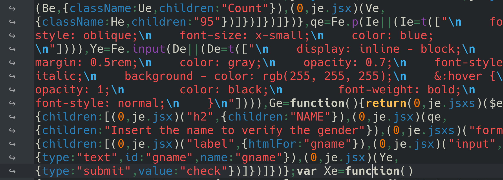
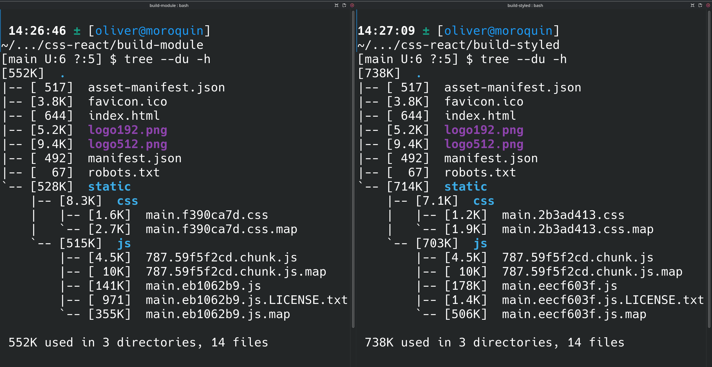

## Styled Components

Styled components allow to create React components with the css styling. The styled components aims to help the developers with: 

* Generating unique class names for the styles that we use, basically create a component that we can use. Reduces the bugs that causes using class names. 
* Simplified the maintainence of the styling code, easier to modify or deleting css. 
* Autmatically manage the code splitting, getting better experience for the users at the moment of loading our application. 
* This aproach makes sure that you dont have trouble with css collitions if you define styles differents in diferents components. 

To install Styled Components you should install the following packages

```bash
npm install styled-components --save
```


It's important to appoint that is a production dependency. In the next example 

In this case we are goint to use the Name.js component. This component should look like this: 

```javascript 
import React from 'react'
import { Article } from '../UI/Article'
import {Comment, Submit} from './styles'

export const Name = () => {
  return (
    <Article >
        <h2>NAME</h2>
        <Comment >Insert the name to verify the gender</Comment>
        <form>
            <label htmlFor='gname'></label>
            <input type='text' id='gname' name='gname'></input>
            <Submit type='submit' value='check' />
        </form>
    </Article>
  )
}

```

And our styled component should looks like:

 ```javascript
import styledComponents from 'styled-components'

export const Comment = styledComponents.p`
    font-style: oblique;
    font-size: x-small;
    color: blue;
`

export const Submit = styledComponents.input`
    display: inline - block;
    margin: 0.5rem;
    color: gray;
    opacity: 0.7;
    font-style: italic;
    background - color: rgb(255, 255, 255);
    &:hover {
        opacity: 1;
        color: black;
        font-weight: bold;
        font-style: normal;
    }
`

 ```


### Conclusion about Styled components
If we create the run build of the project with 

```bash
npm run build
```

In the styled components is important to be aware that the css is not longer use, so the css style is included into the javascript file. We can se the 'main.js' file, and take a look



Now pay attention to '\\n' simbols. It has all the indentation that we use before.  And remember that when we create a built we expect that the failes will be optimized and minimal. 

The points of this approach could be

* We create new components with the styled-components and we are using into our custom components. 
* In other hand our components are easier to read and easier to mantein. 
* The files are not optimized, because it has white spaces and symbols that the file does not needed. 


## module.css versus Styled components 

To have some conclusions, I build the project using styled components and module css and the output is 




The left image has the 'module.css' and the right image is 'styled components'

It is important to point that when I create the project with the 'npx create-react-app' it creates a css global file and i do not delete. That is the reason why the styled component project has a css minimal file. 

Now my perspective is
* Comparing the Javascript files, the 'module.css' has lower size, thinking in the time of loading page the 'styled components' is slower. 
* The styiles from the 'modules.css' is optimized and minimal. The styles from 'styled components' that is included in the main javascript is not optimized and minimal. So with the 'styled components' the page load slower than 'module.css'. 
* The 'styled.components' is easier to mantain and it prevents to have bugs because the names of the classes in compare to 'module.css'. 

So, I preferred to use 'module.css'. If you want to comment what approach you prefer and comment why, it would be great. 

I hope this post help you to understand better the styling your applications. 


