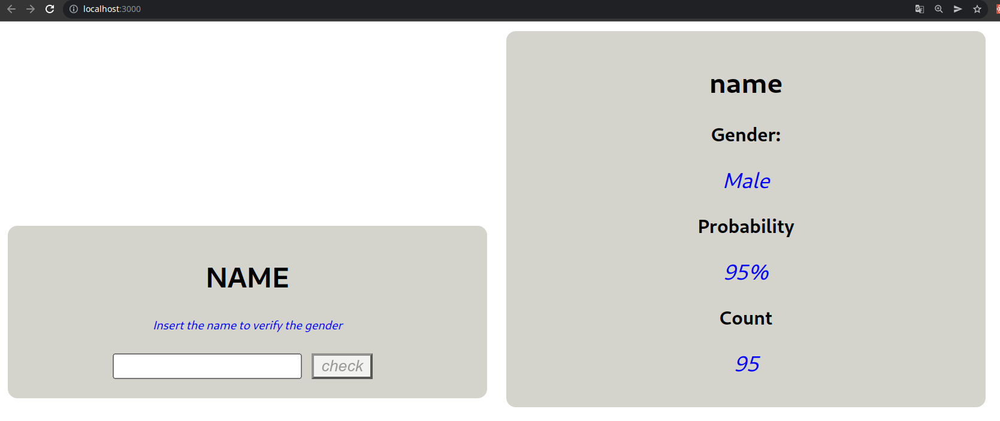
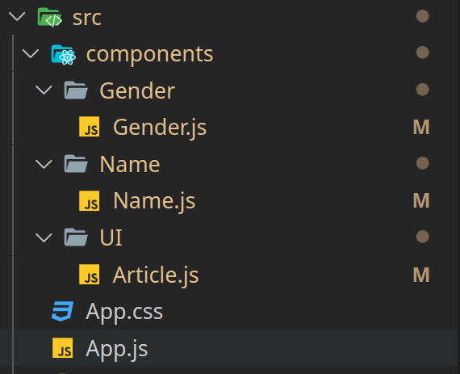

In this post we are going to study two different approach to use styles to our application. The two options that we present in this blog are 'module.css' and 'Styled components'. We are not going to discused about having css global. At the end of the post we are goint to have a conclusion about the two CSS approaches. 

The application is very basic, and we expect it to see like this:



In this APP we are goint to use just tree componentes: 'UI/Article.js', 'Name/Name.js' and 'Gender/Gender.js'. It look like



You can clone the project from the next URL


## module.CSS with react

This aproach let you create css files that will be aplied only in the components you import them, this magic happens because when you build the project it hashes the name aiming to no repeat and have no problems overriting styles. Thats importan to prevent bugs because of collition of the styles of the components. 

This aproach also it is too similar when you are writing HTML and CSS code, because you use classes for the elements you need.  

If you configure your project step by step you have to follow the 'Installing dependencies' section, if not you can go directly to 'Implementing module.css'

### Installing dependencies

If you create your project using the npx create react app, you don't need to install anything. But if you create your project step by step like the folliwing link, you need to install: 

```bash
npm install css-loader style-loader --save-dev
```

Now we have to add the rule to our webpack.config.js, to tell them how he has to treat the css files using into our components

```javascript 
{
	test: /\.css$/i,
	use: ['style-loader', 'css-loader'],
}
```

if you follow the previus post of creating react app from scratch, the webpack.config.js should look like this

```javascript 
const HtmlWebpackPlugin = require('html-webpack-plugin')

module.exports = {
  mode: 'development',
  output: {
    filename: 'app.bundle.js'
  },
  plugins: [
    new HtmlWebpackPlugin({
      template: 'src/index.html'
    })
  ],
  module: {
    rules: [
      { test: /\.js$/, exclude: /node_modules/, use: { loader: 'babel-loader', options: { presets: ['@babel/preset-env', '@babel/preset-react'] } } },
      {
        test: /\.css$/i,
        use: ['style-loader', 'css-loader'],
      }
    ]
  }
}
```


### Implementing module.css

Is important to notices that for combention, it is not mandatory, the css files should be named as 'ComponentName.module.css' adding the 'module' to  the name, so in our component we are going to import 

```javascript
	import classes from './Article.module.css'
```


Now we can use the class styles in our react component, like we showed in the next code


```JSX
	<article className={`${classes.main} ${props.className? props.className:''}`}     >
        {props.children}
    </article>
```


Our css class should looks like:

```javascript
import React from 'react'
import classes from './Article.module.css'

export const Article = (props) => {
  return (
    <article className={`${classes.main} ${props.className? props.className:''}`}     >
        {props.children}
    </article>
  )
}
```

### Some conclutions about module.css

Now we can build  the application to inspect a little bit the output, to do that you can execute:

```bash
npm run build
```

Now we have a new folder that is '/build' inside of that folder we can search the minimal css that should be in the 'build/static/css' folder, if we see a picture of the minimal css


The image shows 

* All the classes names are hashed and the code does not have problems of overriding styles. 
* The minified css file, is optimal, it has only the white spaces that are needed, so the file has te minimium size. 


