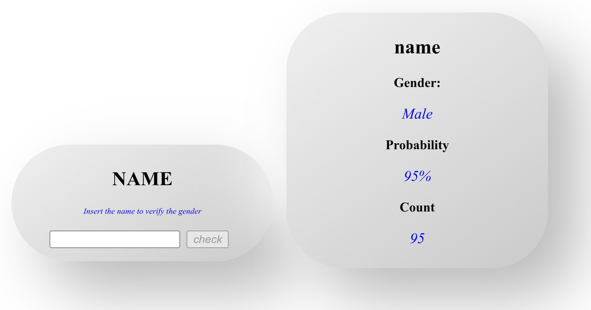
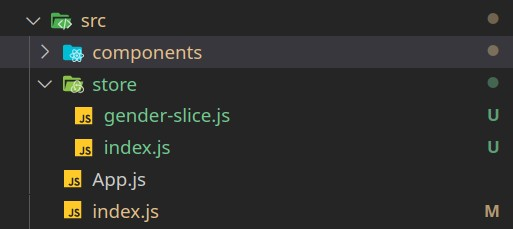
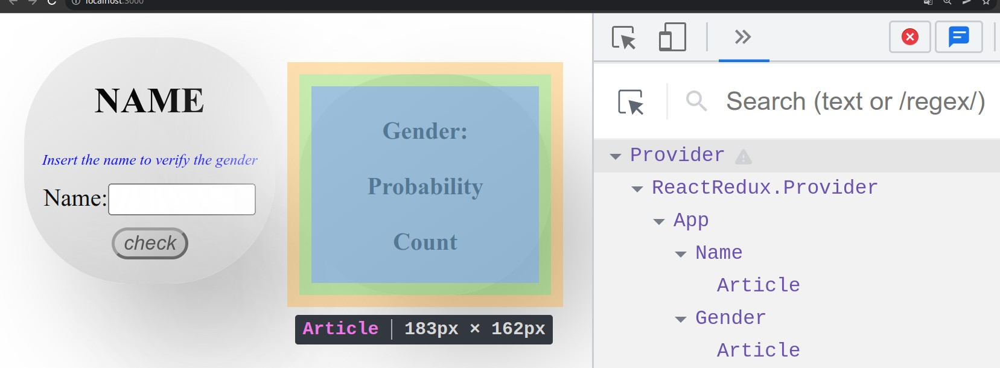
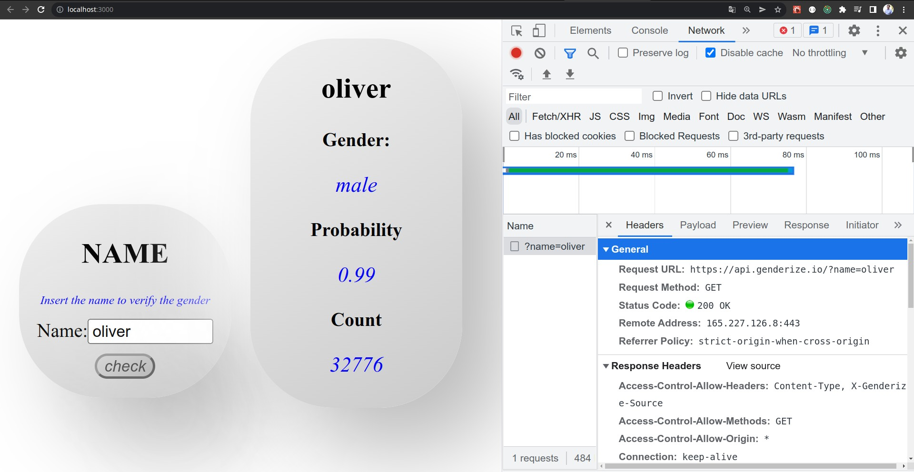

In this post, we are going to create a simple react app that consults an API that receives a name and returns the gender and the probability of the name.

If we are going to use a lot of data, we need to share it across many components. It results in many states and reducers, and having all of them in a single file will be a mess. As a result, we must divide our store into separate files, each of which will be named slice.

The API that we are going to consume is https://api.genderize.io/

And the interface of our app is



If you want to see the introduction of redux with reaction, you can check the following post.

## steps

To achieve our goal, we are going to follow the next steps:

1. Install redux, and the redux toolkit.
2. Creating our store
3. Creating our slices
4. Providing our store
5. Consuming data from the store
6. Changing the state of our store
7. Running the project


## Install redux, and the redux toolkit.

We must install the packages.

```bash
npm install redux react-redux @reduxjs/toolkit
```

## Creating our store

Now we are going to create a store folder inside the "src" directory. Inside, we are going to create a file.

* "index.js", which contains the main configuration of our store, will be in charge of managing all the slices we are going to create.

```javascript
import  { configureStore } from "@reduxjs/toolkit";
import genderSlice from './gender-slice';

const store = configureStore({
    reducer: {
        gender: genderSlice.reducer
    }
});

export default store;
```

In this file, I import the 'gender-slice'. This file we are going to create in the next step.

The important parts are in the reducer. There we can add as many slices as we have. The first part is the name of the reducer. The name will be used when we call to the reducer in some component. The second argument is the reducer.

```javascript 
gender: genderSlice.reducer
```


## Create our slices

As we said before, we are going to divide our store into slices. Each slice should have all the reducers and the initial state.

Inside our store folder, we are going to create one file for each state that we want to share. In this case,

* "gender-slice.js", which contains the reducers and the initial state and the reducers.

```javascript
import { createSlice } from "@reduxjs/toolkit";

const genderSlice = createSlice({
    name: 'gender', 
    initialState: {
        name: '',
        gender: '',
        probability: '', 
        count: 0
    }, 
    reducers: {
        clear(state, action){
            state.name= '';
            state.gender= '';
            state.probability= '';
            state.count=0 ;
        },
        setgender(state, action){
            state.name= '';
            state.gender= '';
            state.probability= '';
            state.count=0 ;
        }
    }
});

export const genderActions = genderSlice.actions;

export default genderSlice;
```

It is important to remember that the reducers should be pure functions. In this example, we are going to connect to a rest api, so we have to manage asynchronys. All the asynchrony code should be out of the redux reducers, so in this example, the "fetch" calls will be in the components.

## Preview of our project



### Providing the store

To provide the store, we are going to import "provider" and "store." We need to subscribe our store to our components at the toop of the tree.

In this case, we are going to subscribe to the 'index.js'. It is not mandatory to subscribe to the store in index.js. But it is important to provide the store in the component that is the father of the component children that are going to share the state.

```javascript
import React from 'react';
import App from './App';

import { createRoot } from 'react-dom/client';

import store from './store';
import { Provider } from 'react-redux';

const container = document.getElementById('root');
const root = createRoot(container);
root.render(<Provider store={store}><App /></Provider>);

```

In our case, the components tree looks like this:



The provider should be at least the first parent of the components that have something in common.In this case, we could put the provider in the "App" component.

### Consuming data from the store

We already provide our store. For that, it is as easy as using the 'useSelector' hook from 'react-redux'. It's important to notice that with the line

```javascript 
const genderData = useSelector((state)=>state.gender.data);
```

React makes the component subscribe to the state from Redux, so when the state is changed, the component will be re-rendered. The "Name.js" file should look like this.


```javascript 
import React from "react";
import { useSelector } from "react-redux";
import { Article } from "../UI/Article";
import classes from "./Gender.module.css";

export const Gender = () => {
  const genderData = useSelector((state) => state.gender.data);

  return (
    <Article>
      <h2>{genderData.name}</h2>
      <ul className={classes.list}>
        <li className="list">
          <p className={classes.item}>Gender:</p>
          <p className={classes.description}>{genderData.gender}</p>
        </li>
        <li className="list">
          <p className={classes.item}>Probability</p>
          <p className={classes.description}>{genderData.probability}</p>
        </li>
        <li className="list">
          <p className={classes.item}>Count</p>
          <p className={classes.description}>{genderData.count}</p>
        </li>
      </ul>
    </Article>
  );
};
```

###  Changing the state of our store

When we need to change the data, we need to take the following steps:

1. Import the "useDispatch" hook from "react-redux" to interact with the redux store.
2. import 'genderActions' from the 'gender-slice' file from our slice. With this import, we can execute our reducers and send data in the payload to change it.
3. Use the hook "useDispatch" to execute the "actionReducers" and send the payload data to the redux.

In our project, the 'Name.js' file should look like this.

```javascript 
import React from "react";
import { useDispatch } from "react-redux";
import { Article } from "../UI/Article";
//import { Comment, Submit } from "./styles";
import classes from "./Name.module.css";
import { genderActions } from "../../store/gender-slice";

export const Name = () => {
  const dispatch = useDispatch();

  const formSubmissionHandler = (event) => {
    event.preventDefault();
    const getData = async (name) => {
      const response = await fetch("https://api.genderize.io/?name=" + name);
      if (!response.ok) {
	      dispatch(genderActions.clear());
        //error
        return;
      }
      const responseData = await response.json();
      console.log(responseData);
      dispatch(
        genderActions.setgender({
          name: name,
          gender: responseData.gender,
          probability: responseData.probability,
          count: responseData.count,
        })
      );
    };
    getData(event.target[0].value);
  };

  return (
    <Article>
      <h2>NAME</h2>
      <p className={classes.comment}>Insert the name to verify the gender</p>
      <form onSubmit={formSubmissionHandler}>
        <label>
          Name:
          <input
            type="text"
            id="gname"
            name="gname"
            className={classes.inputName}
          />
        </label>
        <br />
        <input type="submit" value="check" className={classes.submit} />
      </form>
    </Article>
  );
};
```


## Running the project

Now we can run the project and we have our redux with slices working!

