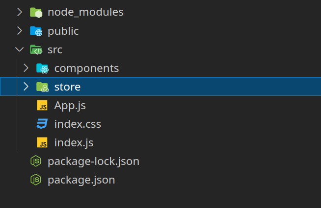
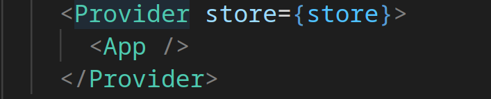
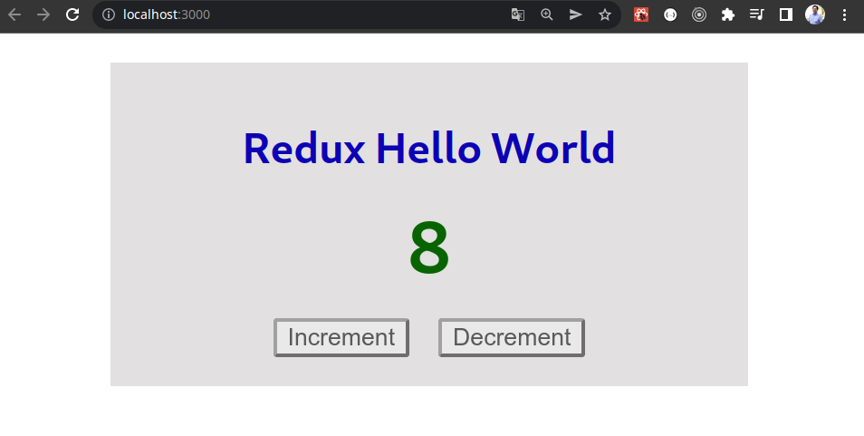

is a state-management-system for cross component or app-wide state

redux is a flux-like state librari  <==============

## When do you want to use Redux

* You have many context states that you need to use cross many components, is a good choice because it makes the code easier to mantain rather than "React Context"
* If you need high frecuency updates is a good choice "Redux"

If you have low frecuency changes and fewer states to share between components you can use "react context".

## Redux functionality

It has a central strore for the state across the application. We can use the central store inside our components, our components, has to subscribe to our data store. Is important to appoint that components never change directly the data in the central store. To manipulate the date we have functions that are named as  "reducer functions". 

As we know the components dispatch actions, so those actions trigger the "reducer functions" of our "redux" then the function changes the state. And all the components that are subscribe are notified. 


## about reducer function

this function should:

* Be a pure function: for the same inputs always return the same response
* 


In this post we are going to do a basic example using "redux" step by step. The goal will be to have a counter that we can increment or decrement.

Let's say that redux is a state management system (flux-like state library) that shares information across several components. 

## When to use redux

You want to use redux when

* You have many context states that you need to use across many components, is a good choice because it makes the code easier to maintain than "React Context."
* If you need high frequency updates, "Redux" is a good choice.


If you have low frequency changes and fewer states to share between components, you can use "react context".


## Creating the project

To create a project that you can carry out

```bash 
npx create-react-app redux-init
```

Or if you want to create your app step by step, you can see the next post:

## Defining our component


We have to create a component folder.
```bash
mkdir src/components
```

Inside the components, we are going to create two files:

**src/components/Counter.js** 
```javascript 
import classes from './Counter.module.css';
const Counter = () => {
  const incrementCounterHandler = () => {
  };
  const decrementCounterHandler = () => {
  };
  return (
    <main className={classes.main}>
      <h1>Redux Hello World</h1>
      <p className={classes.val}>0</p>
      <button className={classes.buttoncss} onClick={incrementCounterHandler}>Increment</button>
      <button className={classes.buttoncss} onClick={decrementCounterHandler}>Decrement</button>
    </main>
  );
};
export default Counter;
```

**src/components/Counter.module.css**
```css
.main {
    width: 20rem;
    text-align: center;
    margin: 1rem auto;
    padding: 1rem;
    background-color: #e2e0e0;
}
.buttoncss {
    margin: auto 0.5rem;
    border-radius: 2px;
    opacity: 0.6;
}
.buttoncss:hover {
    opacity: 1;
}
.main h1 {
    color: #0c00b6;
    font-size: 1.5rem;
}
.val {
    font-size: 2.5rem;
    margin: 1rem 0;
    color: #086400;
    font-weight: bold;
}
```

Now we have to change the "src/App.js" file to render our component:

```javascript
import './App.css';
import Counter from './components/Counter';
function App() {
  return (
    <Counter />
  );
}
export default App;
```

Now we can run 

```bash
npm start
```

We have our main app running:


## Redux with react


We need to install "redux", but we can use it in any javascript project. Because of that, we need to install "react-redux", which is a package that connects our application with our application.

```bash
npm install redux react-redux
```

## Store folder

It is good practice to create a folder to save all your "redux store". For that, create a "store" folder inside the "src". Your project should look like this:




And we can create our index.js file inside the "store" to have our logic. 


## Create a store 

To do so, we must first create our reducer function, which must have:

* state: We need to initiate our state with a default value.
* action: It has a type attribute that tells us what action we want to execute.

With that in mind, we can create our "reducer", and we are going to use "createStore" from the "redux" package, as shown in the next code.

```javascript 
import { createStore } from 'redux';
const counterReducer = (state = { count: 0}, action)=>{
    switch (action.type) {
        case 'increment':
            return {
                count: state.count + 1
            };
        case 'decrement':
            return {
                count: state.count - 1
            };
        default:
            return state;
    }
};
const store = createStore(counterReducer);
export default store;
```

To use our store in other files, we have to export it.


## Provide
We need to provide our "redux store" to the components for which we will need the states. For this, we must look for the highest level in our tree of components that requires sharing the "redux store".

In this example, we are going to provide the "redux store" to the entire application. To that end, in "src/index.js", we need to import the "provider" component from "react-redux".

Now we need to wrap our "<App />" with the provider.  Also we need to specify react which store it should use, we need to import our store file and tell the provider we need to use it. As the image shows:



It is important to note that where we provide the redux-store, the child components, and the children of the children, . . . , they will be able to access it.

The "src/index.js" source code should look like this:

```javascript
import React from 'react';
import ReactDOM from 'react-dom';
import './index.css';
import App from './App';
import { Provider } from 'react-redux';
import store from './store/index';
ReactDOM.render(
  <React.StrictMode>
    <Provider store={store}>
      <App />
    </Provider>
  </React.StrictMode>,
  document.getElementById('root')
);
```


## Accessing the redux store inside our component

Inside the component we are going to use the redux store, we are going to use the "useSelector" hook by "react-redux".

Now we have to change our "src/components/Counter.js". First we add the import.

```javascript 
import { useSelector } from 'react-redux';
```

Now inside our functional component, we can use the function:

```javascript 
const count = useSelector(state => state.count);
```

Now we can use count into our component.

```javascript
<p className={classes.val}>{count}</p>
```
to retrieve the state that we need. The great thing is that, automatically, it works as a state. Whenever the state changes, our component will be re-executed.


It looks like the same image, but now we are using the data in the redux store.

The "src/components/Counter.js" file looks like this:

```javascript 
import { useSelector } from 'react-redux';
import classes from './Counter.module.css';

const Counter = () => {
    const count = useSelector(state => state.count);
    
    const incrementCounterHandler = () => {
    };
    const decrementCounterHandler = () => {
    };

    return (
        <main className={classes.main}>
            <h1>Redux Hello World</h1>
            <p className={classes.val}>{count}</p>
            <button className={classes.buttoncss} onClick={incrementCounterHandler}>Increment</button>
            <button className={classes.buttoncss} onClick={decrementCounterHandler}>Decrement</button>
        </main>
    );
};

export default Counter;
```

## Changin the states of our store

To change the states, we are going to use another hook, "useDispatch" from "react-redux".

```javascript
import { useSelector, useDispatch } from 'react-redux';
```

Create our dispatcher

```javascript 
const countDispatch = useDispatch();
```

With this, it returns a function that dispatches an action to our redux store. With this, we can change the store and all the components. But we need to give an argument to the function to define the action.

```javascript
	const incrementCounterHandler = () => {
        countDispatch({type: 'increment'});
    };
    const decrementCounterHandler = () => {
        countDispatch({type: 'decrement'});
    };
```

Now we are using our redux store.



Our "src/components/Counter.js" should looks like this:

```javascript
import { useSelector, useDispatch } from 'react-redux';
import classes from './Counter.module.css';

const Counter = () => {
    const count = useSelector(state => state.count);
    const countDispatch = useDispatch();

    const incrementCounterHandler = () => {
        countDispatch({type: 'increment'});
    };
    const decrementCounterHandler = () => {
        countDispatch({type: 'decrement'});
    };

    return (
        <main className={classes.main}>
            <h1>Redux Hello World</h1>
            <p className={classes.val}>{count}</p>
            <button className={classes.buttoncss} onClick={incrementCounterHandler}>Increment</button>
            <button className={classes.buttoncss} onClick={decrementCounterHandler}>Decrement</button>
        </main>
    );
};

export default Counter;
```


