in this post, we are going to create a new react project step-by-step. The goal is to understand which dependencies we need and how they work together in the react world. 

## Dependencies 

To work with this mini how to tutorial, you need to have installed NodeJs, 

## Starting the project

To start the project, we need to initiate a node project

```bash
npm init
```

For now, we have an empty project, so we have to create the first structure for our files. For that, we have to create a src folder.

```bash
mkdir src
```

Now we have to create our entry point. To do that, you have to create a file inside the source folder.

```bash
touch src/index.js
```

Our project should look like this:

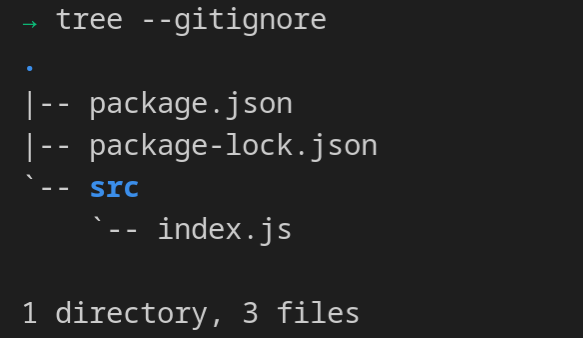

*Notice that the tree command is igno*ring the node_modules folder.

## Bundle the app

Now we have to think about bundling all the future application. To achieve that, we are going to use Webpack. First, we need to install

```bash
npm install webpack webpack-cli --save-dev
```

Now we have to configure Webpack. This tool uses a configuration file. It should be in the root directory, and we have to name it "webpack.config.js". Inside of the file, we have to write the first configuration.

```javascript
	module.exports ={
		mode: "development",
		output: {
			filename: 'app.bundle.js'
		}
	}
```
 
With the previous file, we establish the initial configuration of the webpack. We can execute the command directly in the terminal, but a good practice is to add the build scripts into a "package.json" The build scripts should look like this:

```json
{
	"scripts": {
		"test": "echo \"Error: no test specified\" && exit 1",
		"build": "webpack",
	}
}
```

With the previous script, we should be able to run the following command:

```bash
npm run build
```

Webpack bundles our app, generating one single file for the Javascript code and one for the CSS. At the moment, we only have a javascript file, but after the build command, our directory project should look like this:

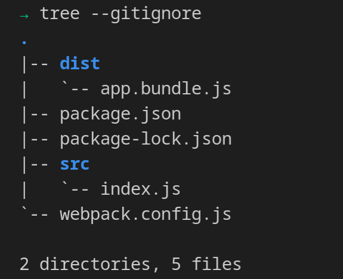

The file app.bundle.js has all the Javascript for our project, and is generated in the dist folder.

### Creating main HTML

It is good practice to create a template of the HTML that the React app will use. For that, inside the src folder, we are going to create an index.html file. And write an HTML template.

```html 
<!DOCTYPE html>
<html lang="en">
<head>
    <meta charset="UTF-8">
    <meta http-equiv="X-UA-Compatible" content="IE=edge">
    <meta name="viewport" content="width=device-width, initial-scale=1.0">
    <title>Document</title>
</head>
<body>
    <div id='app'></div>
</body>
</html>
```

The important parts for the template are the div tag and the "id = app" because it will be used by React to render our future app. 

We need to install the webpack plugin to use an HTML template.

```bash 
npm install html-webpack-plugin --save-dev
```

After the creation of the index.js file, we need to tell Webpack that it has to use the file as the main. For that, we have to change the "webpack.config.js" and add the plugin section. In the HtmlWebpackPlugin, we need to specify the source of the HTML. The configuration file should look like the next code.

```javascript
const HtmlWebpackPlugin = require("html-webpack-plugin")

module.exports ={
    mode: "development",
    output: {
        filename: 'app.bundle.js'
    },
    plugins:[
        new HtmlWebpackPlugin({
            template:'src/index.html'
        })
    ]
}
```

Now if we run "npm run build", our project should look like

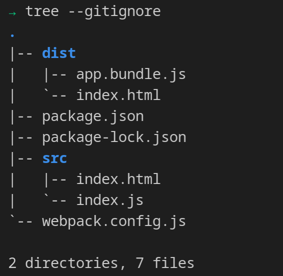

Right now, in the dist folder, the index.html file had the tag to import the "app.bundle.js" file that is added automatically by webpack. 

At the end of this post, you can see another option if you do not want to create an HTML template and you prefer the automatically created HTML template.


### Our First React code
To use React, we need to install two packages, the React core and the React DOM. We can execute the next command.

```bash
npm install react react-dom
```

In the index.html file we have the "id=app" and right now we are going to use that and change our src/index.js and write our first react code.

```javascript
const react = require("react");
const reactDom = require("react-dom");

reactDom.render('Hello World', document.getElementById('app'));
```

Now we can execute.

```bash
npm run build
```

Right now, if you see the app.bundle.js, it has the react core and react-dom functionality and has the functionality at the moment. Right now, we are building our Hello World React program.

We can try the files that are in the build folder.

## Development server

Our application is working for the moment. But it is tedious because with each change we need to execute the "npm run build" command and open the HTML by hand. 

To make our development process efficient, we can install another plugin for Webpack, a development server with the object that it will be aware of every change and run the compilation process each time. We need to install the next package.

```bash
npm install webpack-dev-server --save-dev
```

After the installation, we need to add a new development script, in the "package.json" file.
```json
{
	"scripts": {
		"test": "echo \"Error: no test specified\" && exit 1",
		"build": "webpack",
		"dev": "webpack-dev-server"
	}
}
```

Right now, we can execute the following command.

```bash
npm run dev
```

This development server automatically runs the build command when it detects a change saved in any file. It creates an internal IP and lets us try our application.

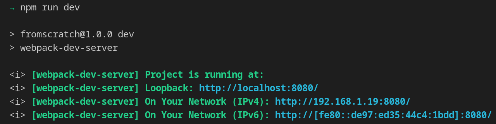


### Using JSX

To use JSX in our components, we need plugins that assure us that the transpile will be correct. To do that, we need to install the next packages.

```bash
npm install @babel/core @babel/preset-env @babel/preset-react babel-loader --save-dev
```
The preset-env packate makes sure that the transpilation will be the newer version accepted by the Javascript commitee. 

Right now, we need to tell Webpack how it has to work with the new packages. We have to change the "webpack.config.js" file.

```javascript
const HtmlWebpackPlugin = require("html-webpack-plugin")

module.exports = {
    mode: "development",
    output: {
        filename: 'app.bundle.js'
    },
    plugins: [
        new HtmlWebpackPlugin({
            template: 'src/index.html'
        })
    ],
    module: {
        rules: [
            {
                test: /\.js$/,
                exclude: /node_modules/,
                use: {
                    loader: 'babel-loader',
                    options: {
                        presets: ['@babel/preset-env', 
		                        '@babel/preset-react']
                    }
                }
            }
        ]
    }
}
```

We can modify index.js right now, and we can use the JSX language in our components right now.Our index.js can look like

```javascript 
const React = require("react");
const reactDom = require("react-dom");

reactDom.render(<h1>Hello World</h1>, document.getElementById('app'));
```
Running our app on our development server, the result should look like

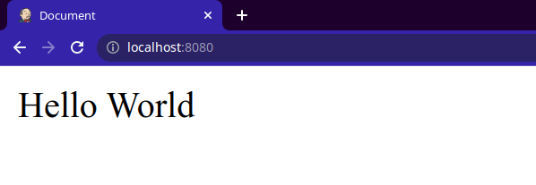


## Creating "App" component

Now we have to create our "App" component that we are going to use as our entry point. For that, we can create an "App.js" file inside the src folder and write react code to use it as a functional component.


```javascript
import React from 'react'
export default function App () {
  return (
    <h1>Hello world from App component</h1>
  )
}
```

When we have a component, we can use it in our "index.js".

```javascript 
const React = require('react')
const reactDom = require('react-dom')
const { App } = require('./App')
reactDom.render(App, document.getElementById('app'))

``` 

Now we can check the page again.

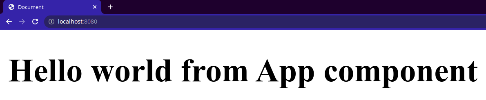


## Stylling our code
We already have a project working with React. But if we are working with more people, it is important that our code be easy to read. Because of that, we need to use "standard" because this package comes with specific rules for javascript and react. To install the package, you should execute the next command in your terminal.

```bash 
npm install standard --save-dev
```

Once the package is installed, we should add the "lint" script to our "package.json".


```json
{
  "scripts": {
    "test": "echo \"Error: no test specified\" && exit 1",
    "build": "webpack",
    "dev": "webpack-dev-server",
    "lint": "standard"
  }
}
```


Right now, we have to ignore the "dist" folder because we do not care about the "lint" in the output file. To achieve that, we are going to add a "standard" configuration into the "package.json" file.

```json
{
	"scripts": {
	    "test": "echo \"Error: no test specified\" && exit 1",
	    "build": "webpack",
	    "dev": "webpack-dev-server",
	    "lint": "standard"
	  },
	  "standard": {
	    "ignore": [
	      "/dist/**"
	    ]
	  },
}
```

Now we can execute the command:

```bash
npm run lint
```

And the output shows us all the styling rules that we are doing wrong,

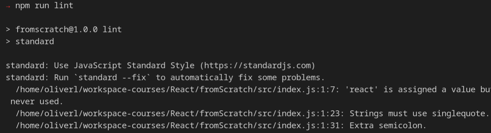

If you want to try to fix some of the warnings, you can run

```bash 
npx standard --fix
```

Now, if you fix all the warnings, you have a code with good styling practices.

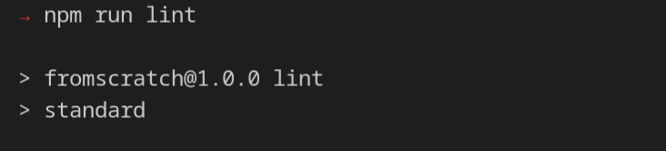

## Styling Guidelines with Our Editor

I use VisualStudio Code, which has a plugin that can help you integrate lint and the configuration into your actual project. You have to install:
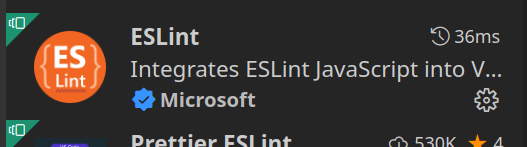

With that, you have the code editor checking the rules for your code. If you want to "esLint" try to format your code every time you save your file, you can go to Settins and enable the next option.

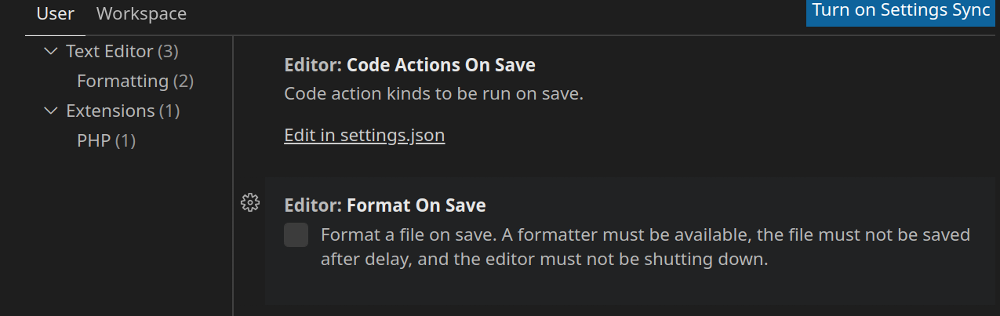

Now you have "VisualStudio Code" to show all the styling warnings.

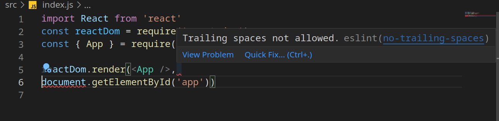

## Configuration Files

"./package.json"

```json
{
  "name": "fromscratch",
  "version": "1.0.0",
  "description": "",
  "main": "index.js",
  "scripts": {
    "test": "echo \"Error: no test specified\" && exit 1",
    "build": "webpack",
    "dev": "webpack-dev-server",
    "lint": "standard"
  },
  "author": "",
  "license": "ISC",
  "devDependencies": {
    "@babel/core": "^7.17.8",
    "@babel/preset-env": "^7.16.11",
    "@babel/preset-react": "^7.16.7",
    "babel-loader": "^8.2.4",
    "html-webpack-plugin": "^5.5.0",
    "standard": "^16.0.4",
    "webpack": "^5.70.0",
    "webpack-cli": "^4.9.2",
    "webpack-dev-server": "^4.7.4"
  },
  "dependencies": {
    "react": "^17.0.2",
    "react-dom": "^17.0.2"
  },
  "standard": {
    "ignore": [
      "/dist/**"
    ]
  },
  "eslintConfig":{
    "extends": ["./node_modules/standard/eslintrc.json"]
  }
}
```

"./webpack.config.js"

```javascript
const HtmlWebpackPlugin = require('html-webpack-plugin')

module.exports = {
  mode: 'development',
  output: {
    filename: 'app.bundle.js'
  },
  plugins: [
    new HtmlWebpackPlugin({
      template: 'src/index.html'
    })
  ],
  module: { rules: [{ test: /\.js$/, exclude: /node_modules/, use: { loader: 'babel-loader', options: { presets: ['@babel/preset-env', '@babel/preset-react'] } } }] }
}

```

Our project structure should look like this:


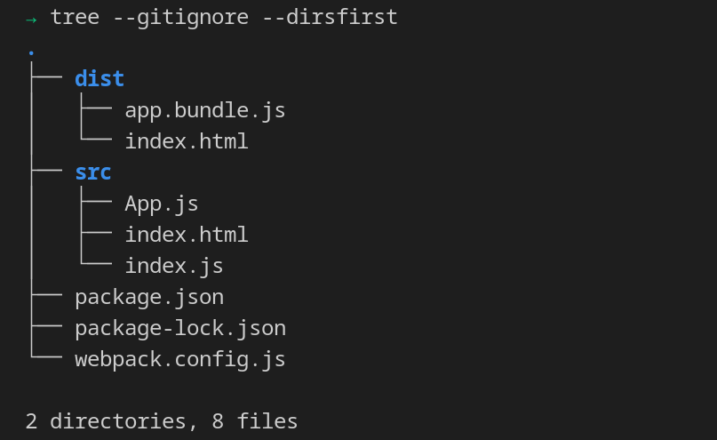


### webpack-html plugin
Para crearnos un html por defecto. 

Instalación

```bash 
npm install html-webpack-plugin --save-dev
```

configuramos el *webpack.config.js*

```javascript
const HtmlWebpackPlugin = require("html-webpack-plugin")

	module.exports ={
		mode: "development",
		output: {
			filename: 'app.bundle.js'
		},
		plugins:[
			new HtmlWebpackPlugin()
			]
		}
```

Y esto nos genera el html para devolver la respuesta


En el index.js agregamos el código 

```javascript
const react = require("react");
const reactDom = require("react-dom");

reactDom.render('Hola Mundo', document.body);
```

Si ejecutamos este código tendremos la aplicación funcionando. 


### Primeros pasos con react

En el index.js agregamos el código 

```javascript
const react = require("react");
const reactDom = require("react-dom");

reactDom.render('Hola Mundo', document.body);
```

Si ejecutamos este código tendremos la aplicación funcionando. 
