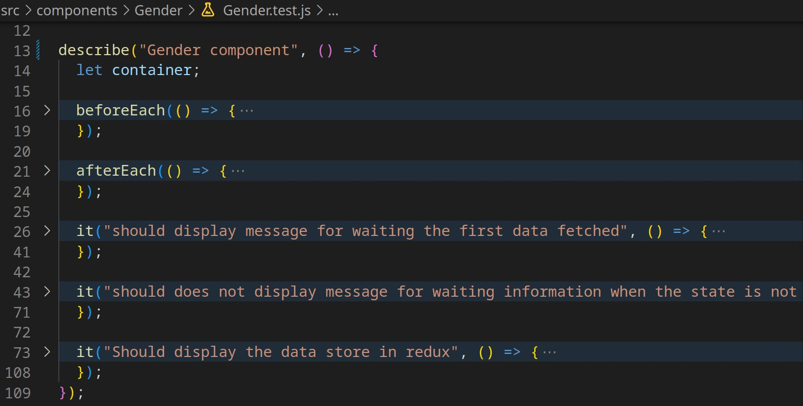
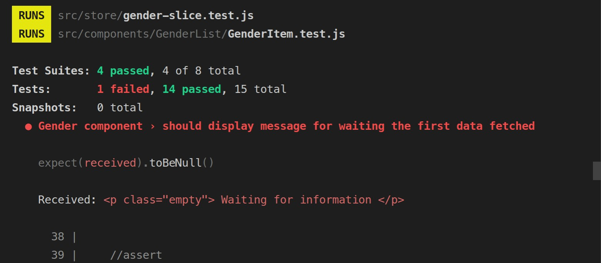
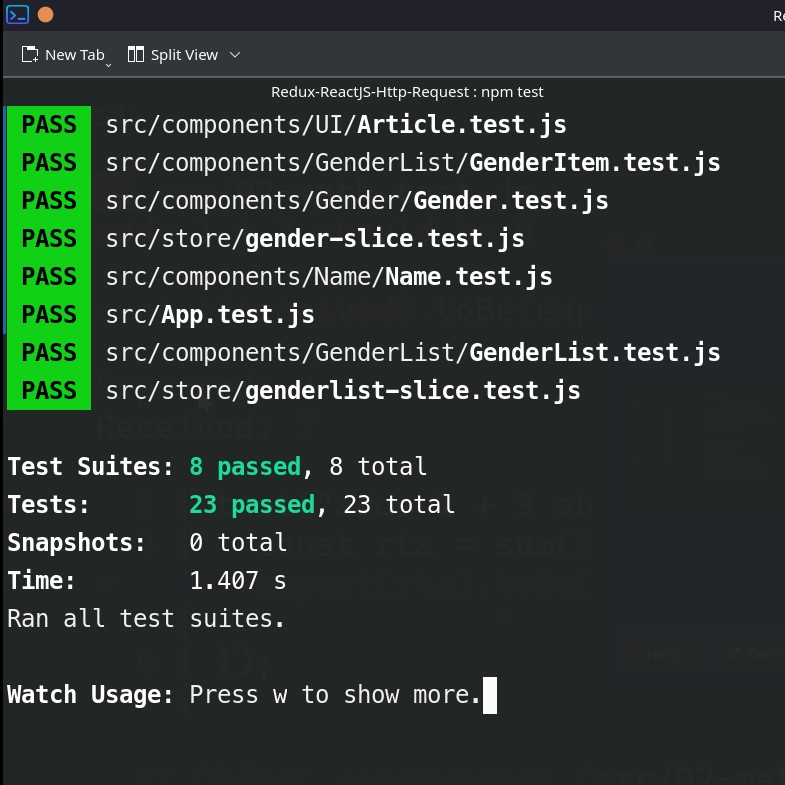
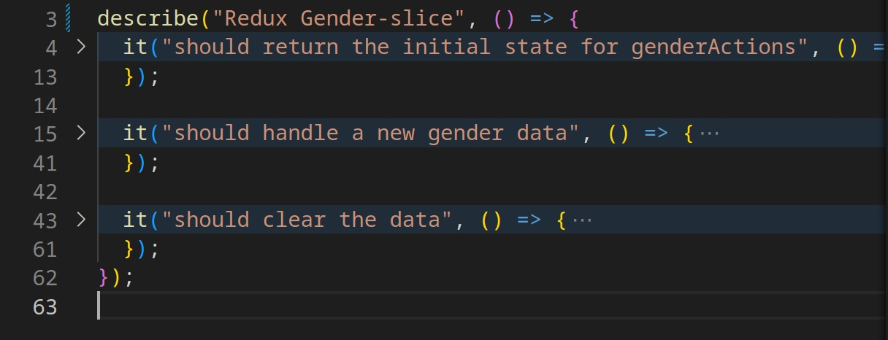

In the following post we will make a small example of test with react 18, we will talk in a general way about testing, the post is not intended to deepen each topic but to give a global overview. 

As a summary we could say that testing our application is very important, since it allows us to be sure that the behaviors we test work properly. We can test from the most basic that can be functions, objects or very specific behaviors. Once this is assured we can test how they work as a whole, how they work consuming other services.

For this purpose, we can classify the tests into four groups:

1. Unit tests: we test individual blocks, such as functions or components running on their own. Of these we write many to ensure that each small part of our application works. Usually our applications will have many. 
2. Integration tests: These are based on testing the integration of several blocks or functions. That when they work together they give the expected result. They are important and we usually focus more on unit tests, however it is good to test the integration of components.
3. End to end tests: We test complete, working scenarios, these scenarios are much smaller than integration and unit scenarios, and parts of them are often done by hand.  
4. Static tests: seek to check for errors in the software at the development stage. This includes tests to verify compliance with coding standards within the team or project, as well as specialized tools to verify the developed code. For this we can use eslint. Typescript helps in this part. 

In the example we will use we will only perform unit and integration tests. 

## What should you test?

Now comes the question of what we should test, for unit tests we should focus on the smaller components that together make our entire application. This way we can know if each part works. The advantage of focusing on small tests is that we can perform very focused tests on the scenarios we need to test. It is also important to point out that having tests focused on evaluating a reason is very useful, since if a test evaluates several scenarios and fails, we will not know which of all the scenarios was the cause. 

For this specific case, our project is organized as follows


Due to the organization of the components in this article we will show only the tests for the following components, but the rest of the tests can be found in the repository

* Unit Tests: of the basic parts of the application we will test, for this example we will test: 1) Redux: slices 2) UI components: that show the content that we pass as props, 3) Basic components: we will test that an item of the history list is generated correctly, that it works when we click on the delete button. 
* Integration Tests: in this part we will test 1) the history component defining particular states to redux, here we will have to make sure that the elements are deleted and that they are not visualized. This is done with each element that is worked with redux. 2) We will make a complete test, when we enter a name, that updates the information of the last query and adds it to the history, that also is deleted when we click on delete. 


## Planning how to perform our tests

Now comes the part of implementing our tests for this we will say that in general we must establish a context or an initial configuration that will serve as a reference. With a defined context we can execute or trigger events in our program and thus be able to predict the output. Finally we must verify that the output we have is as expected. In general we can say that we must base our tests on the three A's, which are: 

1. Arrange:  define the initial configuration of our test, the environment and initial conditions. For this we can use two important behaviors, "BEFOREEACH" and "AFTEREACH". These are used to create a general context for all the tests that are part of a "SUITE" and in the same way reset the context or clean it for the following ones.
2. Act: execute the logic of what needs to be tested. 
3. Assert: compare the result of our tests if it is what we expected. 

## Organizing our tests

To organize our tests we can use "TEST SUITE" which allows us to group a set of tests, and within this suite we can have many tests, as shown below: 



Something important is that our tests allow us to read and inform us about what we are testing, for that we can use words like "SHOULD" and tell us something. 

For example, if we read the first test with everything and the suite indicates that 

"GENDER COMPONENT > SHOULD DISPLAY MESSAGE FOR WAITING THE FIRST DATA FETCHED"

If we have a failure in the test, it gives us a very good indication of what is not being done, where and how to fix it in a very easy way, as shown below: 



That is the importance of grouping our tests, and that both the grouping and the tests have appropriate names to facilitate error correction. 

## Defining our test environment in React 

We need a tool to test our tests and test results. In addition to this we need a tool to simulate the rendering of our application and all its components, in this case we will use:

* Jest
* React testing library

If the project was created with NPX the dependencies are installed by default, but if you created the project by hand the dependencies we need to install are:  

```bash
npm install --save-dev @testing-library/jest-dom @testing-library/react @testing-library/user-event
```

Our files for conversion must be called component.test.js, with the extension .test.js, in this way react recognizes that they are tests and will execute them as such. 

To run our tests we must:

```bash
npm test
```

and we will have an output like the following:



## Testing redux and components

If you want to try the tests and review you can see the following repository. There we test redux and the components as shown below:





In a following article we will perform a step-by-step test. 

[Enlace al repositorio](https://github.com/sierra-oe/Redux-ReactJS-Http-Request)