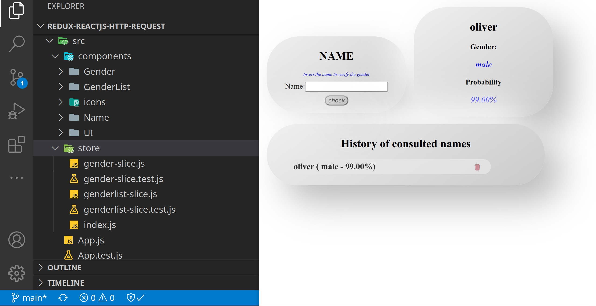

En el siguiente post haremos un pequeño ejemplo de test con react 18, hablaremos de manera general de testing, el post no pretende profundizar cada tema sino dar un vistazo de manera global. 

Como resumen podríamos decir que testear nuestra aplicación es super importante, ya que nos permite estar seguros de que los comportamientos que testeamos funcionan de manera adecuada. Dado esto podemos plantearnos que un principio para testear podría ser indicutivo, dado esto podemos testear desde lo más básico que pueden ser funciones, objetos o comportamientso muy especificos. Una vez asegurado esto podemos testear como funcionan estos en conjunto, y asi sucesivamente. 

Para esto podemos clasificar los tests en cuatro grupos:

1. Unit tests: probamos bloques individuales, como por ejemplo funciones o componentes funcionando solos. De estos escribimos muchos para asegurar que cada parte pequeña de nuestra aplicación funciona. Usualmente nuestras aplicaciones tendran muchos. 
2. Integration tests: estos se basan en probar la integración de varios blockes o funciones. Que estas cuando trabajen juntas den el resultado esperado. Son importantes  y usualmente nos enfocamos mucho más a los tests unitarios, sin embargo es bueno probar la integracion de los componentes. 
3. End to end tests: probamos escenarios completos, de funcionamiento, estos escenarios son mucho menores que los de integración y de los unitarios, y muchas veces partes de estos se realizan a mano. 
4. Pruebas estáticas: buscan comprabar si hay errores en el software en la etapa de desarrollo. Dentro de esto se incluyen pruebas para verificar el cumplimiento de estandares de codificación dentro del equipo o proyecto, ademas hay herramientas especilizadas para verificar el código desarrollado. Para esto podemos utilizar eslint. Typescript ayuda en esta parte. 

En el ejemplo que utilizaremos únicamente realizaremos pruebas unitarias y de integración. 

## What you shuld test

Ahora viene la pregunta de que deberiamos probar, para los tests unitarios debemos enfocarnos en los componentes más pequeños que en conjunto hacen nuestra aplicación entera. De esta manera podemos saber si cada parte funciona. La ventaja de enfocarnos en tests pequeños es que podemos realizar tests muy enfocados en los escenarios que necesitamos probar. También es importante señalar que tener tests enfocados en evaluar un motivo es muy util, ya que si en un test probamos evaluar varios escenarios y falla, no sabremos cual de todos los escenarios fue el causante. 

Para este caso en especifico nuestro proyecto esta organizado de la siguiente manera




Dada la organización de los componentes en este articulo mostraremos únicamente los tests para los siguientes componentes, pero el resto de tests lo puedes ver en el repositorio

* Unitarias: de las partes básicas de la aplicación probaremos, para este ejemplo probaremos: 1) Redux: slices 2) Componentes UI: que muestren el contenido que pasamos como props, 3) Componentes básicos: probaremos que un item de la lista del historial se genera de manera correcta, que funciona cuando damos click en el boton de eliminar. 
* De integración: en esta parte probaremos 1) el componente del historial definiendo estados particulares a redux, aca deberemos asegurarnos que se borran los elementos y que no son visualizados. Esto se hace con cada elemento que se trabaja con redux. 2) Haremos una prueba completa, cuando ingresemos un nombre, que actualice la información de la última consulta y lo agregue al historial, que tambien se borre cuando demos click en borrar. 

## Setup our enviroment

Necesitamos una herramienta para probar nuestros tests y los resultados de los mismos. Además de esto necesitamos una herramienta para simular el renderizado de nuestra aplicación y de todos sus componentes, en este caso utilizaremos:

* Jest
* React testing library

Si el proyecto fue creado con NPX las dependencias vienen instaladas por defecto, pero si creaste el proyecto a mano las dependencias que necesitamos instalar son:  

```bash
npm install --save-dev @testing-library/jest-dom @testing-library/react @testing-library/user-event
```

Nuestros archivos por convensión deben llamarse component.test.js, con la extención .test.js, de esta manera react reconoce que son pruebas y las ejecutará como tal. 

Para ejecutar nuestros tests debemos:

```bash
npm test
```

y tendremos una salida como la siguiente:


## Setup our tests

Debemos basarnos en las tres A para escribir nuestros tests:

1. Arrange: definir la configuración inicial de nuestro test, el ambiente y condiciones iniciales. 
2. Actuar: ejecutar la lógica de lo que necesita ser testeado. 
3. Assert: comparar el resultado de nuestros tests si es lo que esperabamos. 


