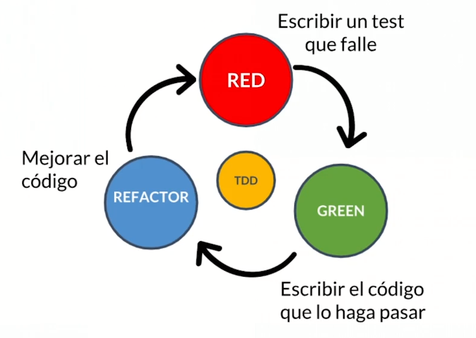

# Test driven  development

El desarrollo de nuestras clases es creado por los tests. Creado por Kent Beck. Iniciamos escribiendo el test antes de las clases, si los tests son complicados debemos verificar nuestro diseño de clases. 

Tiene los siguientes pasos 

pasos:

1. RED: escribimos el test
2. GREEN: escribimos el código para que pase
3. REFACTOR: mejorar la clase

## Reglas del TDD

1. Sólo escribirás código de test hasta que falle
2. Sólo escribirás código de producción si es para pasar un test que falla
3. No escribirás más código de producción del necesario para pasar el test

