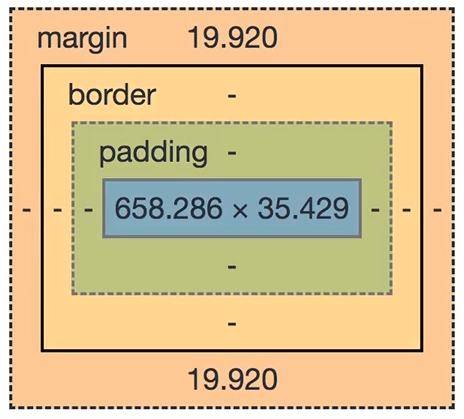

# Boxes




## Margin collapsing

Si tienes dos elementos contiguos gana el elemento que tenga el margen más grande. Por eso en general es mejor utilizar margin-top o margin-bottom 

[Margin collapsing firefox](https://developer.mozilla.org/en-US/docs/Web/CSS/CSS_Box_Model/Mastering_margin_collapsing)
**1. Adjacent Siblings**: In this case, the first element might have a margin of `10px`  (on all sides let's say) and the second one has `5px`  (or `20px`  - the values don't matter). CSS will collapse the margins and only add the bigger one between the elements. So if we got margins of `10px`  and `5px` , a `10px`  margin would be added between the elements?
**2. A parent with children that have a margin**: To be precise, the first and/ or last or the only child has to have margins (top and/ or bottom). In that case, the parent elements margin will collapse with the child element(s)' margins. Again, the bigger margin wins and will be applied to the parent element. 
If the parent element has padding, inline content (other than the child elements) or a border, this behavior should not occur, the child margin will instead be added to the content of the wrapping parent element.
**3. An empty element with margins**: This case probably doesn't occur that often but if you got an element with no content, no padding, no border and no height, then the top and bottom margin will be merged into one single margin. Again, the bigger one wins.

## Shorthand properties

Combinan multiples valores en una sola propiedad

```css
border-style: dashed;
border-color: #2ddf5c;
border-width: 5px;
```

shorthand

```css
border: 5px dashed #2ddf5c;
```

```css
margin-top: 5px ;
margin-right: 10px ;
margin-bottom: 15px ;
margin-left: 20px ;
```

shorthand

```css
margin: 5px 10px 15px 20px;
margin: top right bottom left;
margin: top&bottom left&right;
margin: allSides;
```


## Box sizing

A with and height hay que sumarle el padding, border y el margin, estos son valores aparte, y se suman separado. 

Para que estos  sean sumados podemos usar:

* border-box: incluye el border pero no el padding
* content-box: solo incluye el contenido 

```CSS
box-sizing: border-box;
```