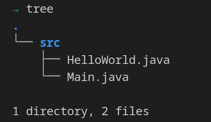
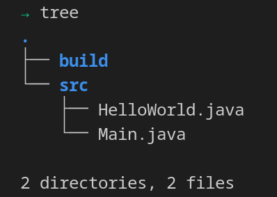
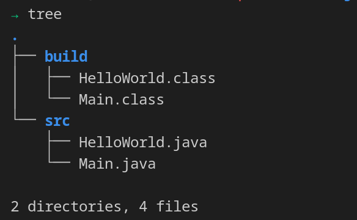
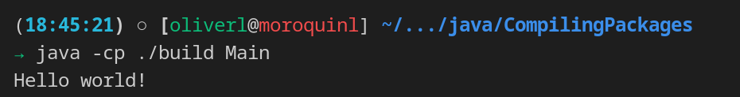

## pre-requisites

To do this mini how-to you need:

* JDK installed on your machine. At least version 8. 
* Text editor
* Access to your terminal (bash)

## Setup the project 
In this post, we are going to compile multiple files from the command line **without using packages**. If you want to see how to compile projects that are using packges follow the link. 

For this example, we are using two files. The code of the files should be: 

*HelloWorld.java*
```java
public class Main {
    public static void main(String[] args) {
        new HelloWorld();
    }
}
```
*HelloWorld.java*
```java
public class HelloWorld {
    public HelloWorld(){
        System.out.println("Hello world!");
    }    
}

```

These files should be inside of one folder named "*src*". The structure of the project will be like the next image. 


We want to have a *build* folder to save the bytecode files (.class). For that, 
 we are going to create a folder. If you are using GNU/Linux you can do that with the next command.

```bash
mkdir build
```

Now we have the project structure like that:



## Compile the project
To compile the project, we can execute the Java compiler with the next command in bash.


```bash
javac -d ./build src/HelloWorld.java src/Main.java
```

* **javac** is the java compiler
* **-d** argument tells the compiler where the compile files should be saved. In this case **./build** is the route.
* **src/HelloWorld.java src/Main.java** tells the compiler which files should compile

Another variant to the command before could be

```bash
javac -d ./build src/*.java
```

The only change is how we specify the files to compile 

* **src/\*.java**  specifies that we want to compile all the java files. For that we use the wild card **\***.  

## The output of the compile

Now we can see that the compiler creates files in the *src* folder with the *.class* extension.



## Executing our project
To execute our project, we must type in our terminal the next command: 

```bash
java -cp ./build Main
```

* **java** basically starts an application by starting the Java virtual machine. 
* **-cp** specifies the directory where our compiled files are. In this case we have the *build* folder for that. Thats the reason for write **./build**
* **Main** in this case, Main is the name for the class that has the entry point. In java the entry point is the method *public static void main(String[] args)*



