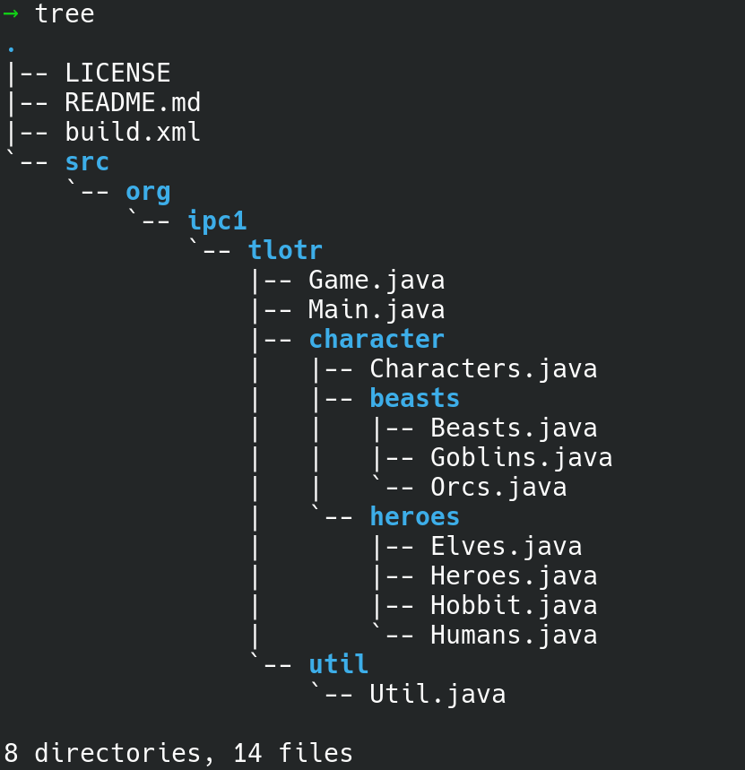
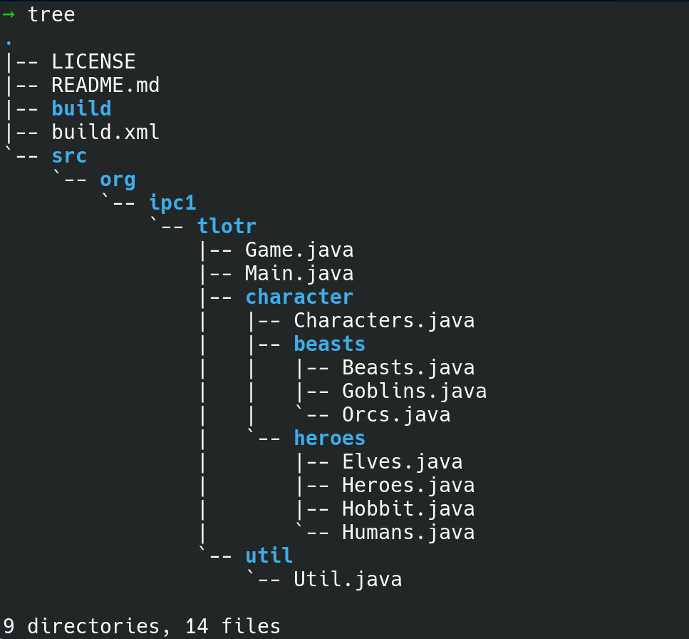

## pre-requisites

To do this mini how-to, you need:

* JDK installed on your machine. At least version 8.
- Text editor
- Access to your terminal (bash)
* If you want to build the [example, you can download the project from github](https://github.com/sierra-oe/TheLordOfTheRings-TerminalGame-Java)
	* If you want to clone the project with Github, you need to install the local client for your operative system. 

## Setup the project 

You can download the project from GitHub as a zip file, or you can clone the repo with the next command:

```bash
git clone https://github.com/sierra-oe/TheLordOfTheRings-TerminalGame-Java
```

Once you have the folder, the structure of the project that we aim to build is:


We are going to describe the packages and folders we have in the project:
* **src** we have this folder for all our code. It is important to notice that *src* is not part of the packages. 
* **org/ipc1/tlotr** is the main folder that has the main package **org.ipc1.tlotr**. In these folders, whe have our entry point in the file *Main.java*. 
* **org/ipc1/tlotr/util** has files that are useful for the project/
* **org/ipc1/tlotr/characters** has the class for the characters. 
* **org/ip1/tlotr/characters/heroes** has the classes for the heroes characters. 
* **org/ip1/tlotr/characters/beasts** has the classes for the beasts characters. 

The entry point is in the next file:

**org/ipc1/tlotr/Main.java**

We want to have a "build" folder to save the bytecode files (.class). For that, we are going to create a folder. If you are using GNU/Linux, you can do that with the next command.

```bash
mkdir build
```

Now we have the project structure like that:



## Compile the project
To compile the project, it is important to pay attention to the next things.

* To use the "javac" command, you need to be in the source code folder. In this example, we need to be inside the "src" folder because all the packages do not include "src" in their definition.
* To compile all the packages, the Java compiler does not check recursively each folder (package). To compile all the packages, you need to specify each one explicitly.

we can execute the Java compiler with the next commands in bash.


```bash
cd src
javac -d ../build org/ipc1/tlotr/*.java
javac -d ../build org/ipc1/tlotr/util/*.java
javac -d ../build org/ipc1/tlotr/characters/*.java
javac -d ../build org/ipc1/tlotr/characters/beasts/*.java
javac -d ../build org/ipc1/tlotr/characters/heroes/*.java
```

 Or we can execute it all in the same line.

```bash
cd src
javac -d ../build org/ipc1/tlotr/*.java org/ipc1/tlotr/util/*.java org/ipc1/tlotr/character/*.java org/ipc1/tlotr/character/beasts/*.java org/ipc1/tlotr/character/heroes/*.java
```

* **javac** is the java compiler
* **-d** argument tells the compiler where the compiled files should be saved. In this case, **./build** is the route.
* **src/ipc1/tlotr/...** tells the compiler which packages it has to compile. It is important to add each package (folder). It is not recursive. 
* **../*.java**  specifies that we want to compile all the Java files inside a directory. For that, we use the wild card **\***.  

## The output of the compile

Now we can see that the compiler creates all the compiled files (bytecode) inside the build folder. Notice that the compiler creates the same structure that is defined in the src.  The next image only presents the build folder, the other files and folders do not change.


## Executing our project
To execute our project, we must be in the project's root directory. We must type the next command into our terminal:

```bash
java -cp ./build org.ipc1.tlotr.Main
```

* **java** basically starts an application by starting the Java virtual machine. 
* **-cp** specifies the directory where our compiled files are. In this case we have the *build* folder for that. Thats the reason for write **./build**
* **org.ipc1.tlotr.Main** in this case, we specify the package and the class that have the entry point that is ubiquitiated in the Main file. 


## Creating a Jar file

Inside the project's root directory, we are going to create a dist folder to save the jar file.
```bash
mkdir dist
```

Now we have to move into the build folder, the directory where we have the.class files (bytecode). Inside that directory, we are going to create a manifest.txt file. This file should have the next text inside.

```text
Main-Class: org.ipc1.tlotr.Main
```

The main class indicates the entry point of this project. Now we can create the jar file. We should execute the next command:

```bash
jar cvfm ../dist/tlotr.jar manifest.txt org/ipc1/tlotr/*.class org/ipc1/tlotr/util/*.class org/ipc1/tlotr/character/*.class org/ipc1/tlotr/character/beasts/*.class org/ipc1/tlotr/character/heroes/*.class
```

* **jar** the jar command creates a new compressed file for classes and other resources. 
* **cvfm** it refers to **C** --> create, **v** --> verbose, **f** --> to specify the filename, **m** --> to indicate that the jar file has a manifest file. 
* **manifest.txt** indicates the name and location of the manifest txt
* **org/ipc1/tlotr/ .../** specifies all the packages and resources that we need to add to the jar file. It is important to notice that this command is not recursive.

The output should looks like 


And the directory of the build and dist folder look like this


## Executing the JAR

To execute the jar file, we need to run the next command.
```bash
java -jar dist/tlotr.jar
```

And the project is working.


Now you can enjoy the game.

