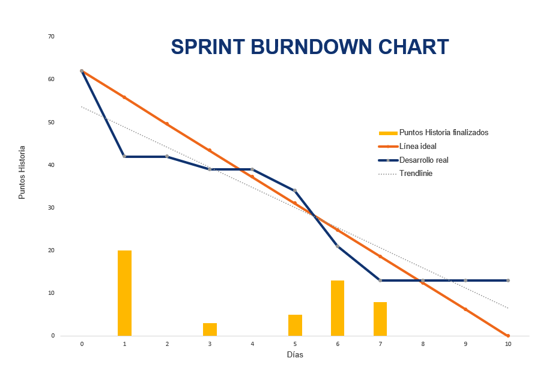
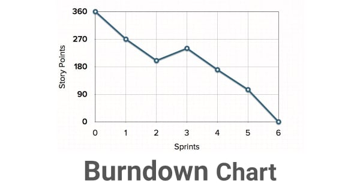

# Evaluar progreso Scrum 

En entornos VUCA lo que ha ocurrido nos puede ayudar a predecir que es lo que puede suceder. Es importante que el gráfico se adapte al equipo. 

>*Dime como me mides, e intentare como mentirte.* Por eso es importante la transparencia y no son mecanismos de control sino de seguimiento. 

## Sprint BurnDown

Nos ayuda a definir cuantos puntos vamos desarrollando. 
Tenemos trabajo alcanzado por días trabajados. Este se puede evaluar en las reuniones del dayli. 

Nos ayuda a determinar si podemos cumplir los puntos que calculamos por sprint, o nos sobre pasamos o sub estimamos, para adecuar los siguientes trabajos. 

## Release BurnDownChart 

Este gráfico sirve para mostrar el avance del producto total. Nos ayuda a definir como vamos avanzando para poder realizar un realease. 

Nos ayuda a verificar si estamos estimando mal y debemos trabajar en equipo, y readecuar y ser flexibles. Ver como podemos apoyarnos como equipo y como buscamos la mejora continua. 

