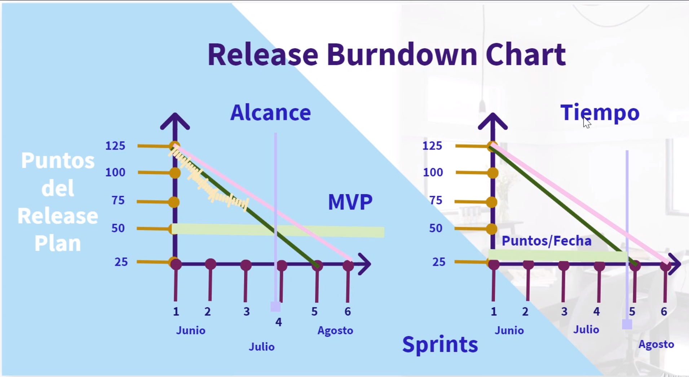

# Product Owner

La persona que esta encargada de guiar sobre que se va a construir. Debe ser el guía y estar pendiente a los cambios del mercado o de los clientes. 

* Visión a largo plazo sobre el proyecto. 
* Dueño total de que se va construir
* El se encarga del product backlog y de los PBI
* No es el dueño de los desarrolladores y que trabajo se hará en cada sprint
	* Los desarrolladores eligen como compromiso, a no alterar ni modificar el sprint, la única excepción del sprint es cancelarlo 
* Posee conocimientos avanzados del público, del mercado, de las tendencias
* Es la voz de los stakeholders, gestionando correctamente el PB y los PBI
* Resuelve dudas de los desarrolladores, estableciendo objetivos claros

Debe: 

* Trabajar por lo menos dos sprints adelante de los desarrolladores. 

## Responsabilidades del PO con el PB

* Se encarga de crear el 
	* Release plan
	* Release Map
	* Release BurnDown/BurnUp chart
* El 50% dedicado al stakeholder, el 50% a los desarrolladores 
* Máxima autoridad en torno al proyecto, Decide fechas
* Maximizar el ROI y el valor creado por Sprint 
* Desarrollar y comunicar el PG(alcanzable) a stakeholders y desarrolladores

**Con el product Backlog** 

* Transparente y a la vista
* Priorizado de acuerdo a criterios
* Ordenado permanentemente 
* Optimizado para aumentar el valor creado
* Asegurarse que los PBI sean claros 

## Visión del producto 

Un product owner por equipo. (Multiples PO bajo un chief Product Owner TPO expertos en ux, Marketing, Negocio, etc . . .)

*Esta jerarquia de Épica, Historia de usuario, tareas es una buena práctica, no obligatoria. *

Para crear la visión del producto -> [[Crear vision producto]]

Es importante tomar en cuenta crear un [[Buen producto potencial]]

## Release Plan 

> Vision clara -> Visión dividida en objetivos y funcionalidades -> Release Burndown -> Roadmap

*Visión dividida debe estar priorizada y ordenada de acuerdo a criterios en conjunto, importante **Si todo es urgente, nada es urgente***

Para el release brundown chart es importante tener un tiempo pesimista, con unos 2 ó 3 sprints de holgura. 

Mientras más lejos estemos de la finalización del producto menos certeras serán nuestras estimaciones, mientras más cerca estemos de la finalización más certeras serán nuestras estimaciones. 

## Roadmap

podemos hacerlo en dos enfoques

* Ciclos de tiempo
* Porcentaje de entregas

Vamos a decir que después de 4 sprint vamos a entregar un hito, (mvp), despues de 5 sprints vamos a entregar otro hito. ver Epicas user story mapping [[Epicas]].

Es el ciclo del uso de una persona. 

**Release map** 

