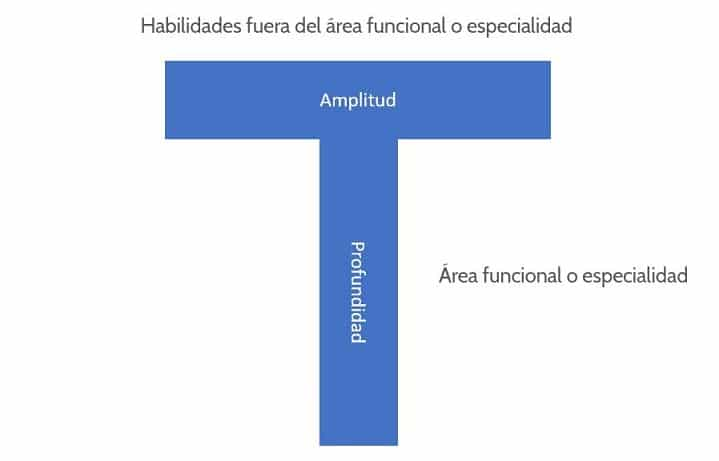

# Scrum Team

Para que sean auto-organizados y multidisciplinarios estos deben de trabajar en T

Con esto decimos que cada miembro tiene un área en la cual es muy bueno pero tiene un área donde el puede tener como disciplina de refuerzo, para apoyar la mejora continua. 