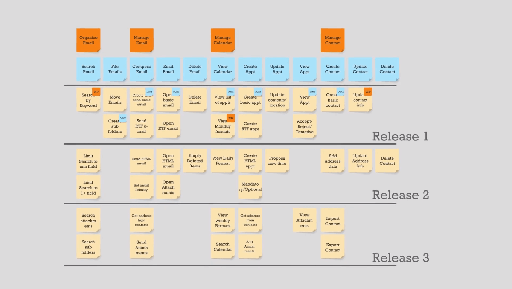
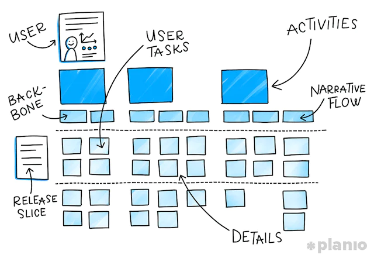

# Épicas
En el caso de Scrum una épica es una historia de usuario (un PBI) que para desarrollarse requiere más de 1 sprint.  Pero por su tamaño aportan mucho valor a su negocio, es una estimación de alto nivel. 

Estas deben dividirse para aportar valor. El refinamiento es una buena práctica para esto. 

En scrum el PO, stateholders y SM/ desarrolladores trabajan juntso creando el roadmap prioritario, de que epica debería ser resuelta primero, en los proyectos siempre se encontrarán varias épicas. 

## User Story Mapping

Nos permite que los stakeholders entiendan como la aplicaicón ira desarrollandose. El release 1 sería el primer [[MVP]]. El release 2 sería el segundo MVP. 

