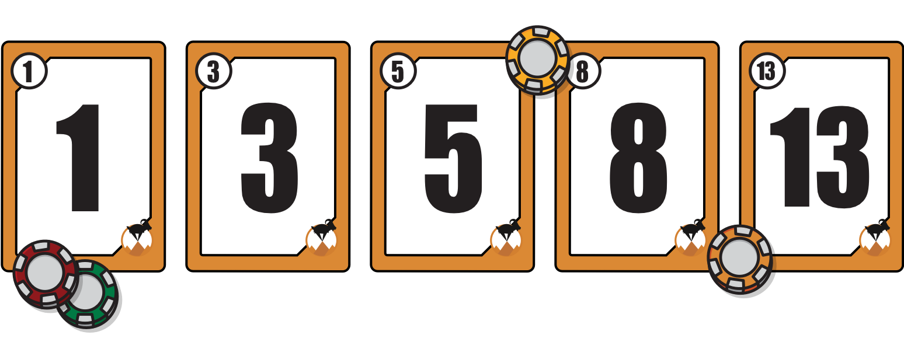

# Estimaciones 

Tipos de estimación:
* **Absoluta**: los tiempos son definidos por el cliente, por el proyect manager, o el product owner. Carecemos de la capacidad de adaptarnos a las circunstancias que puedan ocurrir. 
	* Ejemplo: *diagrama de Gantt*. 
	* Más cerca de metodologías tradicionales
	* Tener cuidado cuando estamos trabajando con estimación por horas. 
	* Para scrum no deberíamos utilizar estimaciones absolutas 
* **Relativa**: en esta no se pone un plazo específico de horas o días. En lugar de poner plazo en horas o días, decimos puntos y hacemos comparaciones, podemos decir para hacer algo me lleva tantos puntos, por lo tanto hacer x cosa es 3 veces el anterior por lo tanto son 3*x puntos. Con los puntos podemos estimar y re definir o ajustar dependiendo del tamaño del equipo. 
	* Es más recomendada para metodologías o frameworks [[Agile]] en entornos vuca. 
	* Es importante que los desarrolladores o los que realizan las tareas son los que lo hacen. Tomar en cuenta a los que construyen o realizan las tareas. 

## Trabajo colaborativo en estimaciones 

Para todas las estimaciones es importante de la colaboración en equipo. Dado que depende del rol que desempeña los casos de uso y la asignación de la calidad de lo desarrollado varia. 

Ej:

> Si realizamos un botón que haga *algo*, y realmente este botón hace el *algo* que debe de hacer para un desarrollador esta bien hecho, pero para el de UX/UI puede que no este bien hecho por los mensajes, formas y demás. 

## Formas de estimación relativa

### Talles 
Técnica que tiene tallas *xs, s, m, l , xl*, se basa en darle una talla a cada tarea. 

Puede organizar todas las tareas que tenemos, iniciamos por la tarea más pequeña, necesita menos recursos y fácil de realizar y le damos *xs*. De allí le damos talla a las demás tareas. Es importante que todo el equipo participe en la asignación. 

### Plainning Poker 
*RECOMENDADA*. 

Se basa en la serié de Fibonacci. 

A cada **miembro del equipo** se le dan cartas con la numeración que se utilice. 

Por cada tarea, cada miembro selecciona una carta, le da vuelta a esta al mismo tiempo que los demás. Es importante que todas las cartas se volteen al mismo tiempo para que nadie del equipo influencie a otros. Es importante que todo el equipo colabore dado la experiencia y visión de cada uno. 

**Puntos de estimación**: 
* Escenario óptimo: las cartas presentadas por el equipo tienen números secuenciales, Ej: *[1,3,5]*, *[5,8,13]*, entonces sacamos el promedio de las cartas seleccionadas y ese será el punto de estimación. 
* Escenario no óptimo:  las cartas presentadas por el equipo no tienen números secuenciales, Ej: *[1,5,13]*, en este caso el miembro del equipo que saco la puntuación de los extremos, la menor y mayor, deben justificar el porque de su respuesta. Posterior a eso se vuelve a hacer la votación por parte de todo el equipo. Si hay algún cambio en la forma de evaluar esta tarea, si salieron estimaciones no secuenciales se repite este escenario no óptimo. Si en la tercera vez sigue sin ser secuenciales utilizamos únicamente las cartas secuenciales y esta se realiza el promedio. 
	* Es importante no una discusión entre el 1 y 13, sino simplemente que cada uno plantee el porque es un 1 y el otro 13, no convencer a nadie. No discutir por gusto. 

***Recomendación*** no utilizar más del número 13, dado que si hay una tarea más grande que 13 pueda convenir dividirla en partes. Máximo deberíamos de llegar a 6 escalas en Fibonacci. 

### Método de canasta
Utilizamos otra vez fibonacci. 

Tenemos un conjunto de canastas. Y cada integrante del equipo tiene todas las tareas e ingresa cada tarea en la canasta correspondiente. Suele ser mejor evaluar tarea por tarea, ya que si sucede lo mismo de *Plainning poker*.

### Votos

En este caso podemos darle a los miembros del equipo fichas de pocker (podemos darle un valor variable de acuerdo a fibonacci  o un valor de 1 a las fichas). 
A cada tarea se le asigna un postit, y cada miembro del equipo le pone fichas o vota por cada tarea, y así podemos estimar o los puntos por cada tarea. Esta no nos permite hablar ni discutir nada por tarea. 

