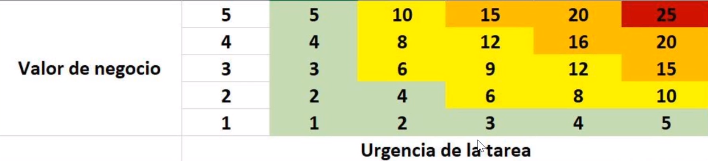

# Priorización de tareas 

Opciones para priorizar, hay muchas variables, y para cada producto hay que seleccionar dependiendo del contexto
* Tiempo
* Esfuerzo
* Valor funcional
* Urgencia
* Opinión de los stakeholders
* Opinión del equipo 
* Valor del mercado (ROI)

## Principio de pareto

Una de las características es que este tiene que ser priorizado.  Ejemplo:

*(US = Historias de usuario, Valor total= ponderación dada por nosotros, Prioridad = asignación de prioridad)*

| US  | Valor Total | Prioridad | Pareto         |
| --- | ----------- | --------- | -------------- |
| A   | 90          | 1         | Dentro del 20% |
| B   | 70          | 2         | Dentro del 20% |
| C   | 22          | 3         | Dentro del 80% |
| D   | 22          | 4         | Dentro del 80% |
| E   | 12          | 5         | Dentro del 80% | 

Para esto podemos ver el **Principio de pareto** que versa en *el 20% de algo ocasiona el 80% de la causa*. Sugiere que un 20% de algo tiene un efecto sobre el 80% de lo que estemos hablando. Si lo aplicamos al product backlog, decimos que con el 20% de las historias de usuario deberíamos haber creado el 80% del valor o utilidad del producto. Utilizar el principio de pareto es una **buena guía para priorizar las historias de usuario**. 

## Priorizando según MoSCow

Podemos variar el orden de todas las características siguientes en un spring, la única que no puede variar es **Mo**, esta debe pasar de primero, posteriormente las demás no necesitamos hacerlas obligatoria mente. Sin embargo la **S** deberíamos de tratar de hacerla, la **Co** podríamos tratar, y la **W** si terminamos las tres anteriores podríamos hacerla. 

>**Mo** tenemos qué (must have): representan una [[Historias de usuario]]
>**S** deberíamos (should have): situaciones que deben de pasar
>**Co** podríamos (could have): posibles situaciones que pueden pasar
>**W** No ahora, pero (Won´t but would have): algunas situaciones que no representan una prioridad

*Recomendación para utilizar esta para los clientes, ya que las historias de usuario son la base de la priorización. *

## Priorizando según Kano

Este sirve si se necesita una mayor personalización para un publico demasiado específico. Priorizando según los siguientes items:

* **Atractiva**: elemento diferenciador, pero de no estar el producto sigue siendo funcional. Pero llama más la atención. Si hay tiempo para realizarla las podemos hacer, sino puede ser en el futuro. 
* **Inversa**: estas características están ligadas al usuario directamente, a un usuario le puede gustar que este y a otros puede disgustarles que este. Depende del contexto y es importante segmentar. 
* **Indiferente**: no importa si están. funcionalidades que se pueden descartar ya que al cliente le da igual si están o no están. 
* **Unidimensional**: No son obligatorias para que el producto funcione, pero de estar estas características el cliente estará feliz, pero si no están el cliente estará molesto. 
* **Requerida**: El producto debe poseer ciertas características, es algo que para el cliente tiene que estar. Priorizar o iniciar en estas características. 

## Priorizando según ROI 

Priorizando según el retorno de la inversión 

> ROI = Valor del cliente / Esfuerzo de creación = valor total

Con esto podemos tener un estimado y podemos priorizar

| US  | Valor cliente | Esfuerzo creación | Valor total |
| --- | ------------- | ----------------- | ----------- |
| A   | 9             | 3                 | 3           |
| B   | 7             | 5                 | 1.3         |
| C   | 2             | 1                 | 2           |
| D   | 20            | 10                | 2           |
| E   | 10            | 5                 | 2           |

Descripción:
* US: historia de usuario
* Valor del cliente: asignado por el cliente. 
* Esfuerzo de creación: asignado por el equipo de desarrollo 
* Valor total: ROI

Después con estos datos utilizamos pareto para organizar las actividades de acuerdo al valor total que obtenemos. Acá la opinión del *product owner* es importante. 

## Priorizando según Planificación estratégica 

Se utilizan dos escalas, valor de negocio (urgencia del cliente), y urgencia de la tarea (equipo de desarrollo). También algún otro contexto. Se multiplica la prioridad del valor de negocio con la urgencia de la tarea y de esta manera priorizamos. Utilizamos pareto otra vez. 

| US  | Valor del negocio | Urgencia de la tarea | Valor total |
| --- | ----------------- | -------------------- | ----------- |
| A   | 5                 | 3                    | 15          |
| B   | 4                 | 5                    | 20          |
| C   | 2                 | 1                    | 2           |
| D   | 2                 | 2                    | 4           |
| E   | 1                 | 4                    | 4           |

 *Recomendación utilizar esta cuando se realizan tareas dentro de la organización.*
