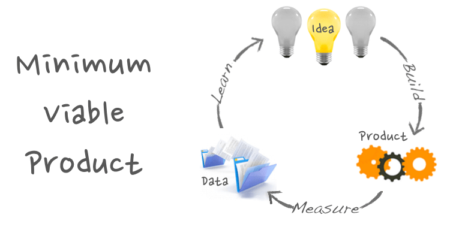

# Producto mínimo viable

> Es una versión de un nuevo producto que permite al equipo recolectar la mayor cantidad de aprendizaje validado, sobre sus clientes, entorno y negocio con el mínimo esfuerzo. 
> *Eric Ries*

También podemos mencionar

> Cualquier cosa que nos permita validar una hipótesis de mercado, que brindara con el paso del tiempo mejores soluciones. 

## Etapas fundamentales

1. Aprender: aprender que es lo que queremos y como lo queremos construir. Aprender si el producto que queremos construir le satisface a los usuarios. 
2. Evaluar: el producto les interesa o no. Tomar en cuenta que es lo más pequeño que podemos construir para validar nuestro producto. 
3. Crear: Creo el producto mínimo para validarlo, y lo evaluó con los usuarios. 
4. Corregir: con los resultados corrijo y re oriento mi producto para aumentarle valor. 
 